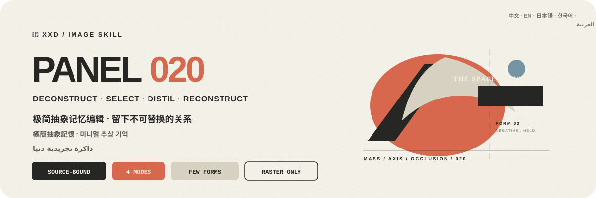
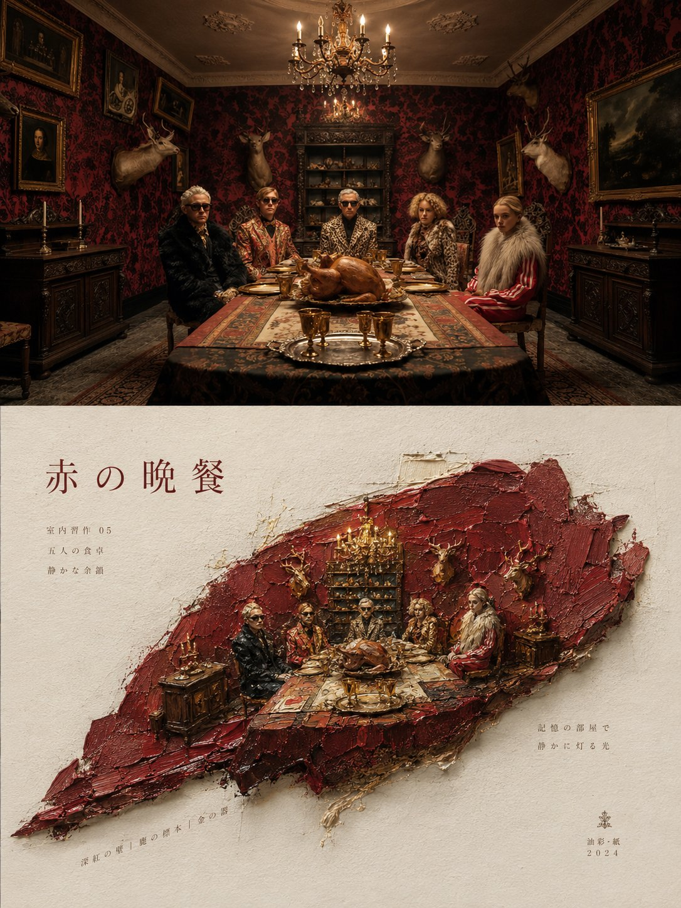
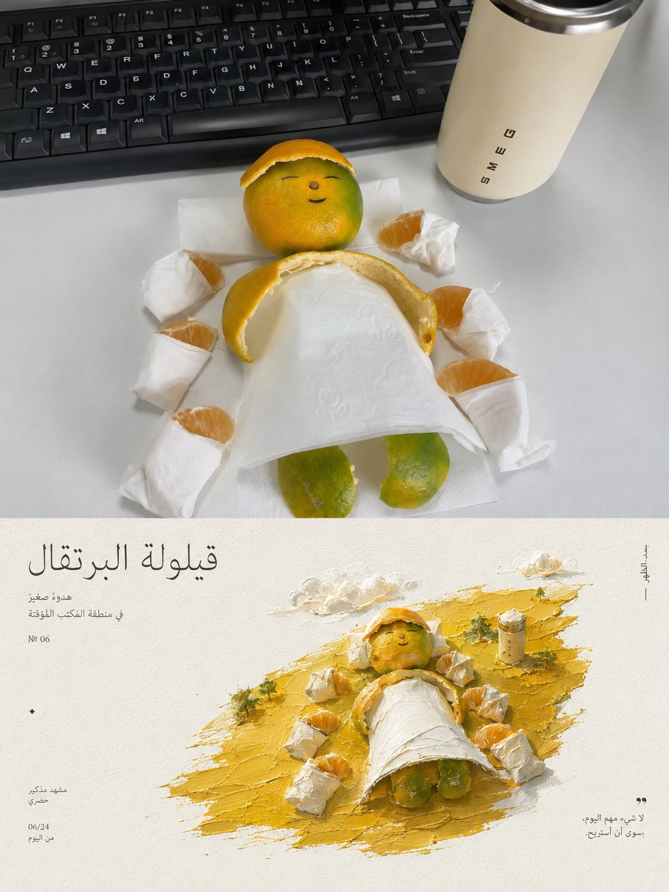
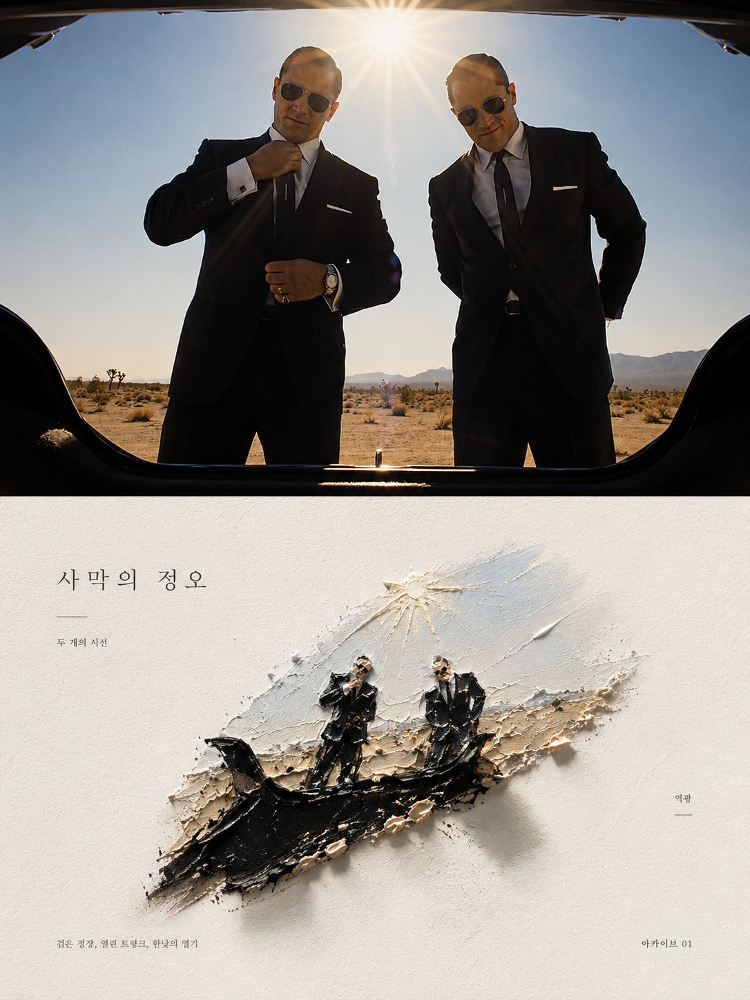
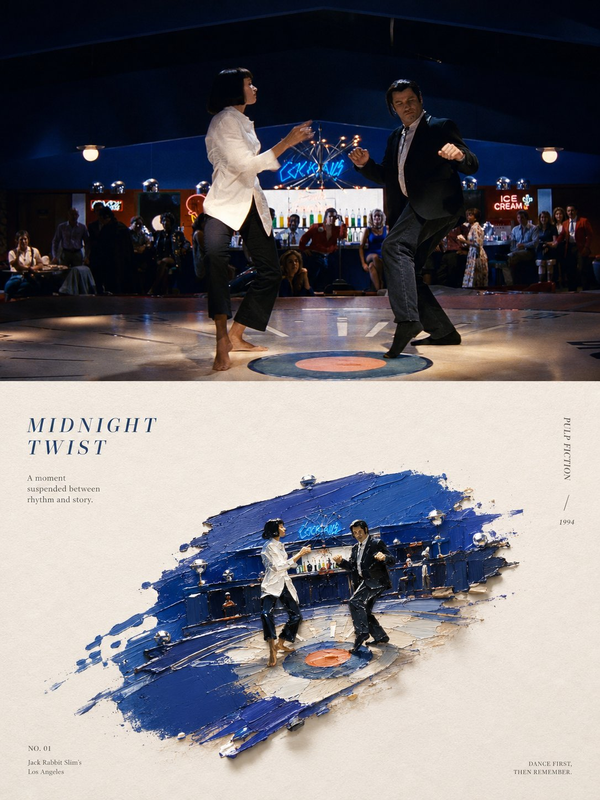

<p align="center">
  
</p>

<div align="center" dir="rtl">

# 🦁 XXD Panel 020

### يقطّر الصورة في ذاكرة تجريدية دنيا ونظام تحريري كامل

[](./SKILL.md)
[](#أربعة-مخرجات-ومنطق-واحد-للذاكرة-التجريدية)
[](#الحدود-والثقة)

<a href="README.md">简体中文</a> · <a href="README.en.md">English</a> · <a href="README.ja.md">日本語</a> · <a href="README.ko.md">한국어</a> · <strong>العربية</strong>

</div>

<div dir="rtl">

> تفكيك—اختيار—تقطير—إعادة بناء · أشكال قليلة · أدوار لونية صارمة · فراغ عاجي · نص مجهري لكتاب فني

XXD Panel 020 مهارة لتوليد الصور مخصّصة لـ Codex والوكلاء المتوافقين. تفكك الصورة وتختار وتقطّر ثم تعيد البناء، محتفظة فقط بأكثر نسب الكتل والمحاور والمنحنيات والتداخلات والطبقات والحجب والفراغات السالبة وفروق المقاس واللاتناظر تميزاً داخل أشكال هندسية قليلة تظل مرتبطة بالمصدر من النظرة الأولى.

تأتي الألوان من المصدر وحده وتُختصر في لون رئيسي ولون بنيوي داكن ولون فاتح أو محايد، مع لمسة صغيرة عند الحاجة. يحمل عنوان شعري من كلمتين إلى خمس كلمات العاطفة، وتحمل مجموعتان إلى أربع مجموعات من النص المجهري النظام والدليل والمادة وإيقاع القراءة: تحفظ الهندسة الذاكرة البصرية ويبني النص المسار التحريري.

## لماذا توجد 020؟

يتحول «الهندسي الأدنى» بسهولة إلى أيقونة عامة أو دوائر وأشرطة اعتباطية أو توزيع متساو أو قالب باوهاوس جاهز أو أشكال زخرفية تصلح لأي صورة.

تعكس 020 هذا الترتيب:

```text
تثبيت الكتلة والمحاور والمنحنيات والتداخلات والحجب والفراغ السلبي واللاتناظر ← تفكيك بنية المصدر ← اختيار العلاقات القليلة اللازمة للتعرف ← تقطيرها إلى أدوار هندسية واضحة ← إعادة بناء مركز واحد بفرق مقياس قوي ← تعيين اللون الرئيسي والداكن البنيوي والفاتح المحايد ← بناء مسار قراءة بعنوان ومجموعتين إلى أربع مجموعات صغيرة
```

إذا أمكن استبدال المصدر بصورة لا صلة لها من دون تغيير جوهري في نسب الكتل أو المحاور أو المنحنيات أو التداخلات أو الفراغات السالبة أو مساحات اللون أو مسار النص، فالنتيجة ليست 020.

## العقد البصري لـ 020

- **بنية المصدر:** تأتي ثلاث علامات خاصة على الأقل من نسب الكتلة والمحور والمنحنى والتداخل والطبقة والحجب والفراغ السلبي وفرق المقياس واللاتناظر.
- **أربع مراحل:** تفكيك الحقائق البنيوية واختيار العلاقات اللازمة وتقطير الأدوار الهندسية وإعادة بناء ذاكرة تجريدية.
- **أشكال قليلة:** لا تُستخدم إلا الدوائر والقطع الناقصة والمستطيلات والأشرطة والأقواس والأوتاد والأسطح غير المنتظمة أو المحيطات البسيطة المستمدة من المصدر.
- **ذاكرة بصرية واحدة:** يصنع فرق المقياس والهرمية والشكل الموجب والسالب والحجب والفراغ العاجي الواسع مركزاً واحداً.
- **أدوار لونية صارمة:** لون رئيسي واحد ولون بنيوي داكن واحد ولون فاتح أو محايد واحد، مع لمسة صغيرة عند الحاجة.
- **نظام نص كامل:** عنوان من كلمتين إلى خمس ومجموعتان إلى أربع مجموعات مجهرية تصنع مسار قراءة على المحاور والحواف والمحيط والكتل اللونية والفراغ السلبي.
- **لا سنة في النص التلقائي:** لا يخترع النص التلقائي سنة ولا يستخدمها، بينما يبقى نص المستخدم الدقيق حرفياً حتى لو احتوى سنة.

## النماذج · من X

> [Xiaoxiaodong (@xiaoxiaodong01)](https://x.com/xiaoxiaodong01/status/2090148356597428723) · 2026-08-19<br>
> GPT2 x 厚涂 x 立体感 x 美学提示词 x VOL.020

<table>
  <tr>
    <td width="50%"><a href="https://x.com/xiaoxiaodong01/status/2090148356597428723"></a></td>
    <td width="50%"><a href="https://x.com/xiaoxiaodong01/status/2090148356597428723"></a></td>
  </tr>
  <tr>
    <td width="50%"><a href="https://x.com/xiaoxiaodong01/status/2090148356597428723"></a></td>
    <td width="50%"><a href="https://x.com/xiaoxiaodong01/status/2090148356597428723"></a></td>
  </tr>
</table>

<p align="center"><a href="https://x.com/xiaoxiaodong01/status/2090148356597428723">عرض المنشور الأصلي والتوجيه كاملاً ←</a></p>

تعرض هذه النماذج الدافع الجمالي للإصدار 020 فقط؛ ولا تصبح موضوعاتها أو تكوينها أو ألوانها أو نصوصها أو نسبة اللوحة السابقة مراجع للتوليد أو إعدادات افتراضية حالية.

## أربعة مخرجات ومنطق واحد للذاكرة التجريدية

يمكن اختيار نمط واحد أو عدة أنماط معاً. أجب بـ `1` أو `1+3` أو `1،2،4` أو `الكل`؛ تزيل المهارة التكرار وتنفّذ بالترتيب الرقمي من 1 إلى 4. يُسلَّم كل نمط مستقلاً داخل مجلد مهمة منفصل ولا يُجمع في لوحة عامة، ويُنتج خيار «الكل» سبعة ملفات PNG لكل مصدر: ملفاً لكل نمط عادي وأربع خلفيات. يمكن تسمية المقاس بحسب النمط في الرد نفسه، وتظل الأنماط العادية غير المسمّاة متكيفة مع المصدر. ويُشارك النص بين الأنماط المختارة افتراضياً مع إمكان تخصيصه لكل نمط.

| النمط | منطق المقاس | الناتج |
| --- | --- | --- |
| `top-bottom` | متكيف مع المصدر | الصورة كاملة في الأعلى، وتحرير 020 للذاكرة التجريدية الدنيا في الأسفل؛ يحتفظ اللوحان بمقاس المصدر وينقسمان 50/50 بدقة |
| `left-right` | متكيف مع المصدر | الصورة كاملة في اليسار، وتحرير 020 للذاكرة التجريدية الدنيا في اليمين؛ يحتفظ اللوحان بمقاس المصدر وينقسمان 50/50 بدقة |
| `design-only` | متكيف مع المصدر | التصميم المتحوّل وحده من دون ظهور الأصل؛ يحتفظ بنسبة المصدر وأبعاده |
| `wallpaper-pack` | أربعة مقاسات أجهزة | ملفات PNG منفصلة للهاتف وiPad والحاسوب وساعة الأطفال |

الأولوية هي: البكسلات الدقيقة التي يحددها المستخدم، ثم النسبة أو الوجهة، ثم التكيف مع المصدر في الأنماط العادية. نسبة 3:4 في ملف `020.md` كانت لوحة إبداعية أولى وليست قيمة افتراضية صامتة في المهارة الحالية.

تبقى المنطقة الفوتوغرافية في الأنماط المزدوجة وفية للأصل، مع تلوين تحريري محدود وتوسيع ضروري للبيئة فقط. في التصميم المنفرد والخلفيات تبقى الصورة دليلاً، لكنها لا تظهر في الناتج.

### حزمة الخلفيات: مترابطة أو مستقلة

لا تملك الحزمة مقاسات افتراضية صامتة. يمكن اختيار الإعداد الشائع: الهاتف `1440×3200`، وiPad `2048×2732`، والحاسوب `3840×2160`، والساعة `1024×1024`، أو تقديم مقاسات مخصصة ومسمّاة لكل جهاز.

- **حزمة مترابطة (موصى بها):** يُنشأ تصميم iPad المرجعي ويُعتمد أولاً، ثم تعيد الأجهزة الثلاثة الأخرى التكوين بالرجوع إلى الصورة الأصلية وإلى المرجع نفسه.
- **أربعة أعمال مستقلة:** يرجع كل جهاز إلى الصورة الأصلية وحدها، ويستكشف ترتيباً مختلفاً لأشكال قليلة وتوازن الفراغ الموجب والسالب ومساحات اللون والمركز اللامتناظر ومسار القراءة.

الترابط لا يعني القص. تُولّد الملفات الأربعة وتُركّب وتُراجع منفصلة، من دون سلسلة مراجع متتابعة تسبب الانحراف.

## النص يبني مسار القراءة في الذاكرة التجريدية

قبل التوليد، اختر نصاً تلقائياً أو نصاً مخصصاً أو نتيجة بلا نص. عند وجود نص، حدّد اللغة أو المنطقة المستهدفة.

يستخلص النص التلقائي عنواناً شعرياً من كلمتين إلى خمس من الضوء أو المكان أو الحركة أو المادة أو العلاقة أو العاطفة، ثم يضيف مجموعتين إلى أربع مجموعات مجهرية. يحمل العنوان العاطفة، وتحمل الصغائر النظام والدليل والمادة والتسلسل والتفصيل.

يمكن أن تستخدم الصغائر جملة قصيرة أو كلمة حالة أو معلومات مؤكدة عن مكان أو موضوع أو رقماً تركيبياً أو علامة فصل أو رمز تسلسل أو رقماً شبيهاً بالمقياس أو كلمة اتجاه أو مادة أو تسمية أرشيفية أو شرحاً صغيراً. لا يستخدم النص التلقائي سنة، ويبقى نص المستخدم النهائي حرفياً.

يحافظ على النص النهائي الذي يقدمه المستخدم حرفياً. أما الاتجاه الإبداعي أو المسودة القابلة للتحرير فلا تُصقل إلا مع الحفاظ على الجمهور والهدف والكلمات الإلزامية والنبرة والدلالة.

تتبع اللغة الجمهور المقصود لا لغة الأمر:

```text
السوق أو الجمهور المستهدف > لغة الناتج المحددة > لغة التوجيه؛ وإذا غابت كلها يُسأل المستخدم قبل التوليد
```

تستخدم النسخة اليابانية يابانية طبيعية، والنسخة الكورية كورية طبيعية بمسافات صحيحة، والنسخة البريطانية إنجليزية بريطانية، وتستخدم العربية افتراضياً العربية الفصحى المعاصرة مع تركيب حقيقي من اليمين إلى اليسار. لا تستنتج المهارة الجنسية من الوجه أو الملابس أو المشهد أو اللافتات، ولا تستخدم نصاً أجنبياً زائفاً للزينة.

## الشيفرة تضبط الهندسة وتوليد الصور يصنع العمل

ينشئ نموذج الصور الأشكال التجريدية القليلة المرتبطة بالمصدر وعلاقات الكتلة والفراغ السلبي والأدوار اللونية الصارمة ونظام النص التحريري الكامل. ولا يتولى `scripts/compose_panel.py` سوى تخطيط اللوحة والتركيب النقطي الدقيق بنسبة 50/50 وتثبيت المقاس والمراجعة؛ ولا يرسم العمل برمجياً.

```bash
python3 scripts/compose_panel.py --plan --layout top-bottom --source photo.png
python3 scripts/compose_panel.py --plan --layout left-right --size 2560x1440
python3 scripts/compose_panel.py --audit result.png --layout design-only --size 2048x2048
```

يتطلب التخطيط العلوي/السفلي الدقيق ارتفاعاً كلياً زوجياً، ويتطلب التخطيط الأيسر/الأيمن عرضاً كلياً زوجياً. لا تغيّر المهارة البكسلات المطلوبة بصمت.

## البدء

```bash
git clone https://github.com/nevertoday/xxd-panel-020.git
mkdir -p ~/.codex/skills
ln -s "$(pwd)/xxd-panel-020" ~/.codex/skills/xxd-panel-020
```

يمكن لمستخدمي Claude Code ربط المجلد نفسه بـ `~/.claude/skills/xxd-panel-020`. أعد تشغيل جلسة الوكيل بعد التثبيت.

```text
$xxd-panel-020
حوّل هذه الصورة إلى تكوين يسار/يمين، واستخرج العبارة من معناها، واكتبها بالعربية الفصحى المعاصرة.
```

يمكن أيضاً استدعاء المهارة بصورة وحدها. ستسأل أولاً عن نمط واحد أو عدة أنماط وعن إعداد النص في قائمة مرقمة متعددة الأسطر؛ ويسأل نمط الخلفيات أيضاً عن الترابط والمقاسات.

المواصفات الكاملة:

- [مسار عمل المهارة](SKILL.md)
- [التوجيه الصيني الكامل](references/xxd-panel-020-prompt.zh-CN.md)
- [التوجيه الإنجليزي الكامل](references/xxd-panel-020-prompt.en.md)
- [موجز الأسلوب الأصلي](references/020-source.md)

## الحدود والثقة

- تبقى كل صورة داخل مهمتها ولا تستعير موضوعاً أو لوناً أو نصاً أو تكويناً من مدخل آخر أو نتيجة قديمة أو نموذج.
- ينشئ كل استدعاء مجلد مهمة جديداً، حتى عند تكرار المصدر والمعلمات.
- النتائج ملفات PNG نقطية، وليست SVG أو HTML أو Canvas أو بديلاً مرسوماً برمجياً.
- لا يعرض جسر الصور المضبوط سوى حالة منزوعة التفاصيل، ولا يكشف المزوّد أو نقطة الاتصال أو الرؤوس أو بيانات الاعتماد أو التوجيه أو نص الاستجابة.
- يعيد كل نمط عادي مختار ملفاً واحداً، ويضيف اختيار `wallpaper-pack` أربع خلفيات مستقلة. يعيد خيار «الكل» سبعة ملفات PNG لكل مصدر داخل أربعة مجلدات أنماط متجاورة، ولا ينشئ لوحة تجميع أو عرضاً عاماً.

يحتاج التركيب المحلي إلى Python 3 وPillow. يستخدم الجسر الآمن `tomllib` في Python 3.11 أو أحدث. ويحتاج توليد الصور إلى قدرة نقطية مدمجة في الوكيل المضيف أو مسار نقطي متوافق ومضبوط مسبقاً.

## المستودع

```text
xxd-panel-020/
├── SKILL.md
├── README.md / README.en.md / README.ja.md / README.ko.md / README.ar.md
├── agents/openai.yaml
├── assets/banner.svg + examples/ (محجوز لنماذج محلية مستقبلية)
├── scripts/compose_panel.py + configured_imagegen.py
└── references/xxd-panel-020-prompt.zh-CN.md + xxd-panel-020-prompt.en.md + 020-source.md
```

## عن XXD

XXD هو الاختصار التجاري لاسم Xiaoxiaodong. أنشأ المشروع ويديره [@xiaoxiaodong01](https://x.com/xiaoxiaodong01).

## الدعم والعضوية

### استشارة متعمقة · 299 يواناً صينياً/ساعة

تبلغ تكلفة الاستشارة الفردية المتعمقة في استخدام Skills مقدار 299 يواناً صينياً في الساعة. للحجز، تواصل عبر رمز WeChat أدناه.

### مجموعة مستخدمي Xiaoxiaodong Skills · 99 يواناً صينياً

تتيح دفعة واحدة قدرها 99 يواناً الانضمام إلى مجموعة تبادل سير العمل ومناقشة الأعمال والدعم بين المستخدمين. ولا تشمل الاستشارة الفردية المحسوبة بالساعة.

### Knowledge Planet＋مكتبة توجيهات الأعضاء · 699 يواناً صينياً/سنة

[Knowledge Planet](https://wx.zsxq.com/group/15554814142882) و[مكتبة توجيهات XXD](https://vip.xiaoxiaodong.ai/) عضوية واحدة: **دفعة سنوية واحدة تفتح الخدمتين من دون شراء ثانٍ.**

1. اشترك عبر Knowledge Planet ثم تواصل عبر WeChat للحصول على رمز استبدال المكتبة.
2. اشترك عبر مكتبة التوجيهات ثم تواصل عبر WeChat للحصول على دعوة إلى Knowledge Planet.

<p align="center">
  <a href="https://xiaoxiaodong.pages.dev/assets/wechat-qr.png"></a>
</p>

<div align="center" dir="rtl">

**التجريد لا يمحو الصورة؛ بل يحتفظ بالعلاقة التي لا يمكن استبدالها.**

</div>

</div>

---

<div align="center" dir="rtl">
  <h2>☕ ادعم هذا المشروع مفتوح المصدر</h2>
  <p>إذا وفّر عليك المشروع وقتاً، فإن نجمة أو مشاركة أو فنجان قهوة يساعد في استمراره.</p>
  <table><tr><td align="center" width="240">
    <a href="https://github.com/nevertoday/zhongguo-traditional-colors/blob/main/docs/images/buy-me-a-coffee-qr.png?raw=true"></a><br>
    <strong>Buy me a coffee</strong><br><sub>امسح رمز QR أو افتحه لدعم Xiaoxiaodong</sub>
  </td></tr></table>
  <p><sub>الدعم اختياري تماماً ولا يغيّر حق الوصول إلى هذا المشروع مفتوح المصدر.</sub></p>
</div>
